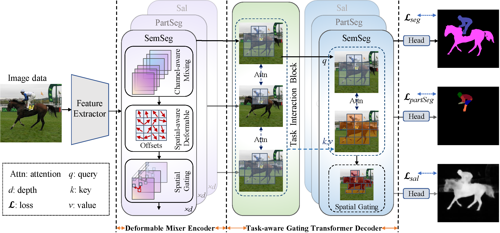
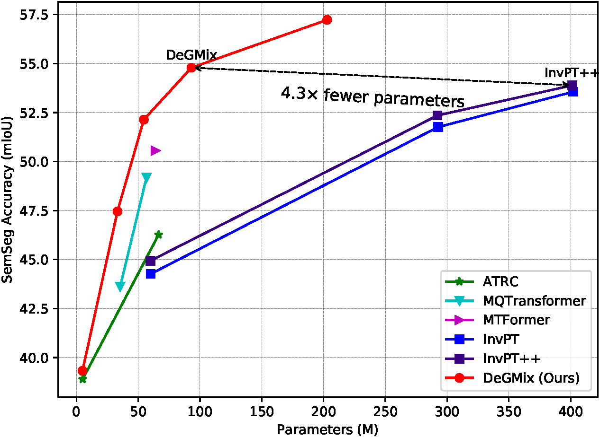

# DeGMix: Efficient Multi-Task Dense Prediction with Deformable and Gating Mixer

This repo is the official implementation of ["DeGMix"](https://doi.org/10.48550/arXiv.2308.05721) as well as the follow-ups. It currently includes code and models for the following tasks:


## Updates

***17/12/2023***
We release the models and code of DeGMix.


## Introduction

**DeGMix** 
We introduce an efficient multi-task dense prediction with **de**formable and **g**ating **mix**er (DeGMix), a simple and effective encoder-decoder architecture up-to-date that incorporates the convolution and attention mechanism within a unified framework for MTL.

First, the deformable mixer encoder contains two types of operators: the channel-aware mixing operator leveraged to allow communication among different channels, and the spatial-aware deformable operator with deformable convolution applied to efficiently sample more informative spatial locations.
By simply stacking the operators, we obtain the deformable mixer encoder, which effectively captures significant deformable features.
Second, the task-aware gating transformer decoder is used to perform the task-specific predictions, in which task interaction block integrated with self-attention is applied to capture task interaction features, and the task query block integrated with gating attention is leveraged to dynamically select the corresponding task-specific features.
Furthermore, the results of the experiment demonstrate that the proposed DeGMix uses fewer GFLOPs and significantly outperforms current Transformer-based and CNN-based competitive models on a variety of metrics on three dense prediction datasets (\textit{i.e.,} NYUD-v2, PASCAL-Context, and Cityscapes).
For example, using Swin-L as a backbone, our method achieves 57.55 mIoU in segmentation on NYUD-v2, outperforming the best existing method by +3.99 mIoU.


Our DeGMix model consists of the deformable mixer encoder and task-aware gating transformer decoder.
![DeGMix]
**An overview of our model jointly handles multiple tasks with a unified encoder-decoder architecture**


Our DeGMix model can outperform existing MTL methods by a large margin while maintaining an optimal balance between accuracy and model parameters.


**Accuracy-to-Parameter trade-off on NYUD-v2 dataset**

## Main Results on ImageNet with Pretrained Models

**DeGMix on NYUD-v2 dataset**

| model|backbone|#params| FLOPs | SemSeg| Depth | Noemal|Boundary| model checkpopint | log |
| :---: | :---: | :---: | :---: | :---: | :---: | :---: | :---: |:---: |:---: |
| DeGMix | Swin-T | 33.2M  |125.49G |47.20	 |0.5660  |20.15  |77.2| [Google Drive](https://drive.google.com/file/d/1Xk-5cmpQrikJyv-fVlfF2YT541rRjyOU/view?usp=drive_link) | [log](https://drive.google.com/file/d/1VpEhzdh66hY3X971WC4kPqwPwWvUoGNh/view?usp=drive_link)  |
| DeGMix | Swin-S | 54.52M |145.84G |52.23	 |0.5599  |20.05	 |78.4 | [Google Drive](https://drive.google.com/file/d/1GNZONi4Y2qm852j5S4t4YdIviu5uRFhg/view?usp=drive_link) | [log](https://drive.google.com/file/d/1Ty8uKsbIc7t67kFvQd9K_uP32Oojdfjk/view?usp=drive_link) |
| DeGMix | Swin-B | 94.4M  |-G      |54.45  |0.5228  |19.33  |78.6 | [Google Drive](https://drive.google.com/file/d/1HKfg4sVnP_FArGN8YGzsumN92vHhS72o/view?usp=drive_link) | [log](https://drive.google.com/file/d/1vM8XAPR1-u_LADWsiXSETtcVetAqnwFC/view?usp=drive_link) |
| DeGMix | Swin-L | 202.92 |321.22G |57.55	 |0.5037	 |19.21	 |79.0 | [Google Drive](https://drive.google.com/file/d/11N8WCL6-nbaE2PRc2EaTDw0oo8a6A6xE/view?usp=drive_link) | [log](https://drive.google.com/file/d/1HTbUvoxp-J-B2E9jQ2LaM6FqODCcHShn/view?usp=drive_link) |
| DeGMix | ViT-B  | 202.92 |321.22G |57.55	 |0.5037	 |19.21	 |79.0 | [Google Drive](https://drive.google.com/file/d/11N8WCL6-nbaE2PRc2EaTDw0oo8a6A6xE/view?usp=drive_link) | [log](https://drive.google.com/file/d/1HTbUvoxp-J-B2E9jQ2LaM6FqODCcHShn/view?usp=drive_link) |

**DeGMix on PASCAL-Contex dataset**

| model | backbone |  SemSeg | PartSeg | Sal | Normal| Boundary|model checkpopint | log |
| :---: | :---: | :---: | :---: | :---: | :---: | :---: |:---: | :---: |
| DeGMix | Swin-T | 69.44	 |58.02	 |83.31	 |14.31  |71.2 | [Google Drive](https://drive.google.com/file/d/1Xk-5cmpQrikJyv-fVlfF2YT541rRjyOU/view?usp=drive_link) | [log](https://drive.google.com/file/d/1-SKKwdIV0yoFhxWrSQqFqwKlgywrVx6H/view?usp=drive_link)  |
| DeGMix | Swin-S | 71.54  |61.49	 |83.70  |14.90  |72.2 | [Google Drive](https://drive.google.com/file/d/14k-mv6apb3iqjb9g6MeYh3a7SIUZWwg7/view?usp=drive_link) | [log](https://drive.google.com/file/d/1O1Dr9_mQYxrsswiHLGzJdj6UP3nbdnm1/view?usp=drive_link)  |
| DeGMix | Swin-B | 75.37  |64.82	 |83.75	 |14.22	 |73.0 | [Google Drive](https://drive.google.com/file/d/1pIs_uAig_eRqhBvjaDagfMBFB7OlSwzw/view?usp=drive_link) | [log](https://drive.google.com/file/d/1WV7VUg0JSTHJxXKJjfUM2QcfCCRWb8rS/view?usp=drive_link)  |
| DeGMix | Swin-L | 78.54	 |67.42	 |83.74	 |14.17	 |74.9 | [Google Drive](https://drive.google.com/file/d/11N8WCL6-nbaE2PRc2EaTDw0oo8a6A6xE/view?usp=drive_link) | [log](https://drive.google.com/file/d/1z9LdP__QLKcEQjg7JIZ0dswWoY0lnG0U/view?usp=drive_link)  |


## Citation

```
@inproceedings{xyy2023DeMT,
  title={DeMT: Deformable Mixer Transformer for Multi-Task Learning of Dense Prediction},
  author={Xu, Yangyang and Yang, Yibo and Zhang, Lefei },
  booktitle={Proceedings of the The Thirty-Seventh Conference on Artificial Intelligence (AAAI)},
  year={2023}
}

@inproceedings{xyy2023DeGMix,
  title={Deformable Mixer Transformer with Gating for Multi-Task Learning of Dense Prediction},
  author={Xu, Yangyang and Yang, Yibo and Ghanem, Bernard and Zhang, Lefei and Bo, Du and Tao, Dacheng},
  booktitle={arxiv},
  year={2023}
}
```


## Getting Started
**Install and Data Prepare**

Please reference to [MQTransformer](https://github.com/yangyangxu0/MQTransformer)


**Train**

To train DeGMix model:
```
python ./src/main.py --cfg ./config/t-nyud/swin/siwn_t_DeGMix.yaml --datamodule.data_dir $DATA_DIR --trainer.gpus 0,1,2,3,4,5,6,7
```

**Evaluation**

- When the training is finished, the boundary predictions are saved in the following directory: ./logger/NYUD_xxx/version_x/edge_preds/ .
- The evaluation of boundary detection use the MATLAB-based [SEISM](https://github.com/jponttuset/seism) repository to obtain the optimal-dataset-scale-F-measure (odsF) scores.


## Acknowledgement
This repository is based [ATRC](https://github.com/brdav/atrc). Thanks to [ATRC](https://github.com/brdav/atrc)!
